# VideoStudio

Professional video stream analysis tool built with C++ Qt and FFmpeg.


## Overview

VideoStudio is a comprehensive video codec analysis application inspired by Elecard StreamEye. It provides professional-grade tools for debugging encoding issues, validating codec compliance, analyzing quality metrics, and inspecting frame-level details.

**Available in two modes:**
- **GUI Application**: Full-featured Qt-based desktop application with interactive analysis
- **CLI Tool**: Command-line interface for batch processing and automation (see [CLI Documentation](docs/CLI.md))

### Key Features

#### Video Analysis
- **Multi-Codec Support**: H.264/AVC, H.265/HEVC, VP9, AV1, MPEG-1/2, MPEG-4, MJPEG, ProRes
- **Container Format Support**: MP4, MKV, AVI, FLV, TS/M2TS, MOV, WebM
- **Raw YUV Viewer**: Open and analyze raw YUV files with automatic format detection (I420, NV12, YV12, etc.)
- **Frame-by-Frame Analysis**: Step through video frame by frame with precise navigation
- **Video Playback**: Play, pause, seek with accurate frame positioning
- **Frame Metadata**: Extract PTS, DTS, frame type, size, QP values, GOP structure

#### Quality & Export
- **Quality Metrics**: PSNR/SSIM/VMAF comparison between reference and distorted videos
- **Duplicate Frame Detection**: Identify and analyze consecutive duplicate frames with configurable similarity thresholds
- **YUV Export**: Export single frames or frame ranges as raw YUV files
- **CSV Export**: Export frame metrics, statistics, GOP structure, and bitrate data
- **Stream Info Export**: Save detailed stream information to text files

#### Analysis Panels
- **Bitrate Panel**: Interactive visualization showing frame sizes, types, and bitrate distribution
- **Transport Stream Analysis**: MPEG-TS packet inspection, TR 101-290 compliance, PSI/SI tables
- **Container Structure**: Detailed MP4 atom, MKV element, AVI chunk, and TS packet inspection
- **Hex Viewer**: Raw byte-level inspection of video files
- **Time Dynamics**: PTS/DTS/PCR timeline analysis
- **GOP Viewer**: Group of Pictures structure visualization with dependency arrows
- **Thumbnail Bar**: Quick frame navigation with visual thumbnails
- **Messages Panel**: Codec warnings, errors, and compliance issues
- **EPG Panel**: Electronic Program Guide data from transport streams
- **Buffer Analysis**: CPB (Coded Picture Buffer) monitoring

#### User Interface
- **Professional UI**: Qt-based interface with dockable panels and smooth animations
- **Internationalization**: Full support for English and Simplified Chinese (简体中文)
- **Dual Theme Support**: Modern dark theme and clean light theme optimized for video analysis
- **Real-time Log Viewer**: Monitor file loading and parsing progress with live log display
- **Context Menus**: Right-click frame analysis and export options
- **Customizable Layouts**: Multiple predefined workspace layouts for different analysis workflows

### Planned Features

- Compliance verification (H.264/H.265 bitstream syntax validation)
- Advanced buffer analysis (HRD/VBV verification)
- Reference stream comparison with side-by-side difference modes
- Command-line tool for batch processing
- Plugin system for custom analyzers

## Screenshots

### Layout 1: Video Analysis Mode
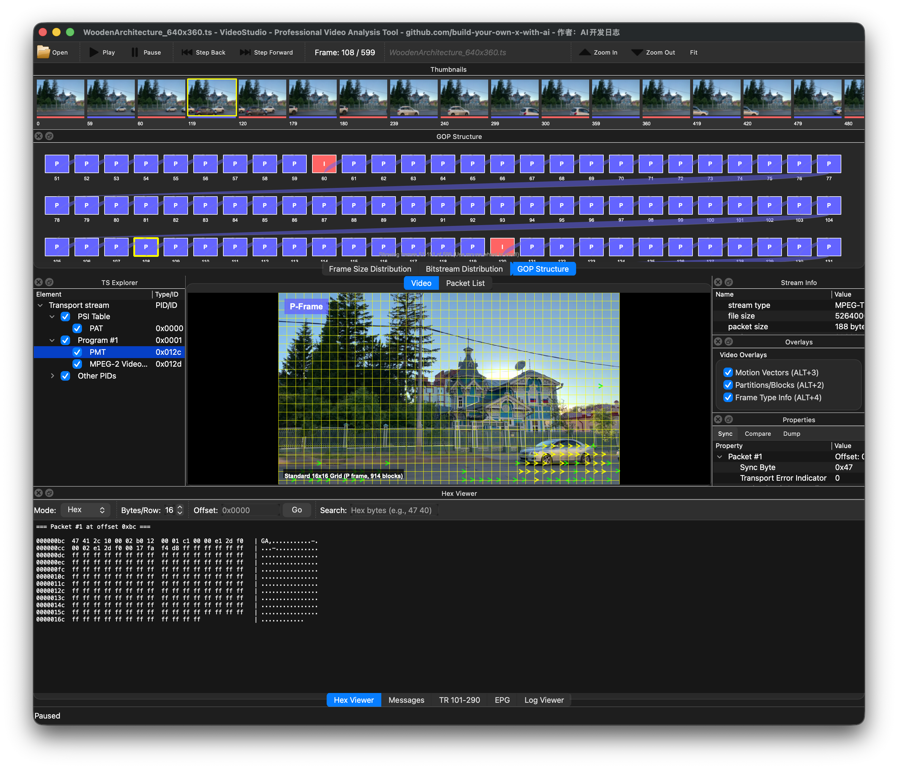
*Main interface showing video playback with bitrate chart, GOP viewer, thumbnails, and stream info panels*

### Layout 2: Transport Stream Analysis
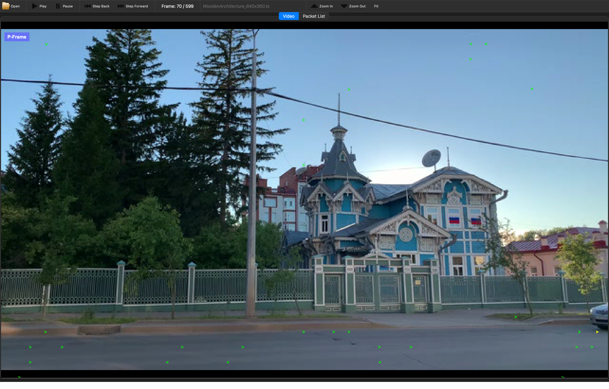
*Transport stream analysis with TS Explorer, Packet View, Property Panel, Hex Viewer, and TR 101-290 compliance*

### Layout 3: Block/Partition Visualization
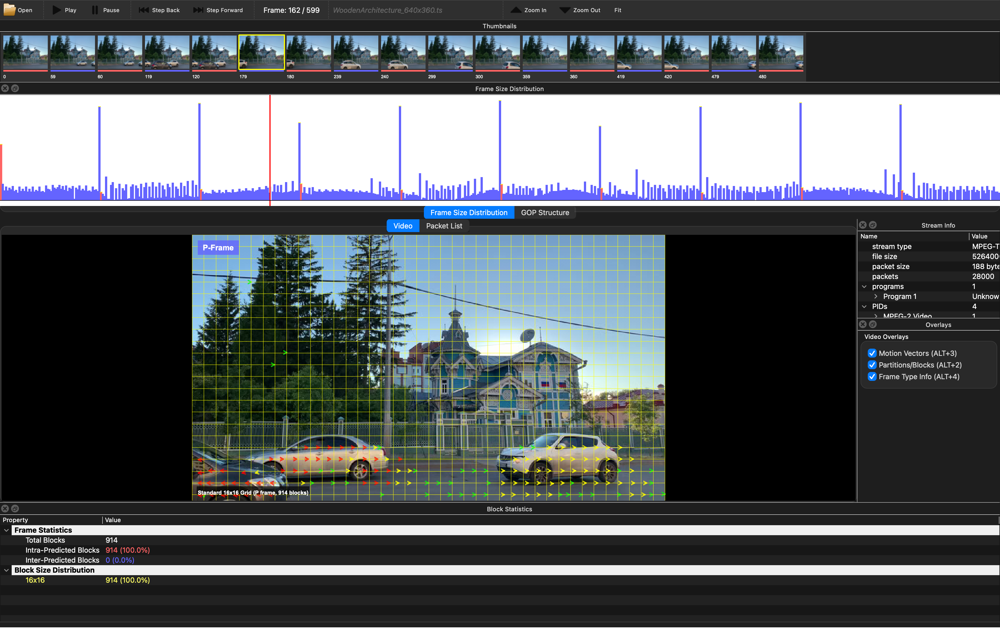
*Motion vector overlay with block boundaries, block statistics panel, and frame-level analysis*

### Layout 4: All Panels View
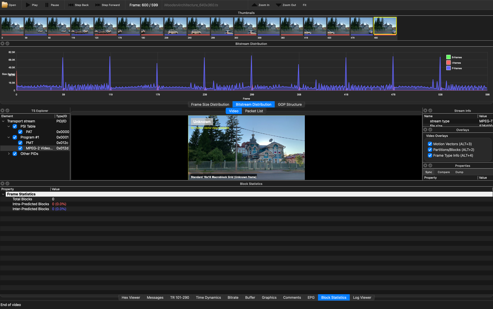
*Complete view showing all available analysis panels for comprehensive codec inspection*

### Layout 5: Quality Metrics Comparison
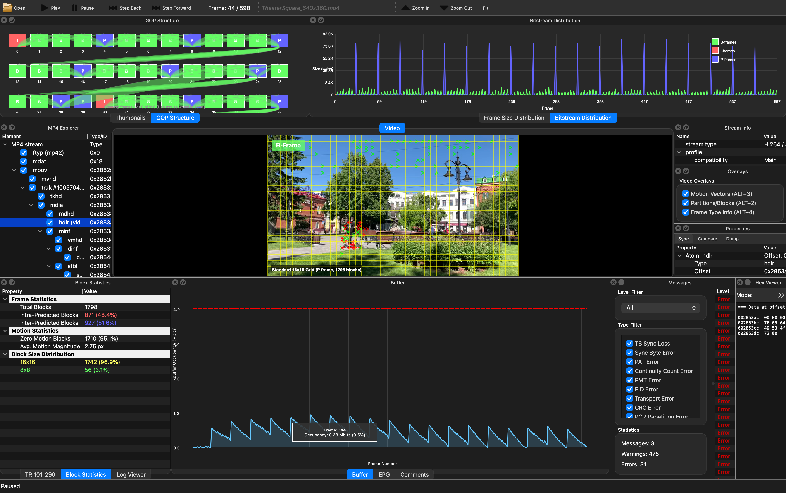
*PSNR/SSIM comparison dialog for reference vs distorted video analysis*

### Layout 6: All Visible Panels
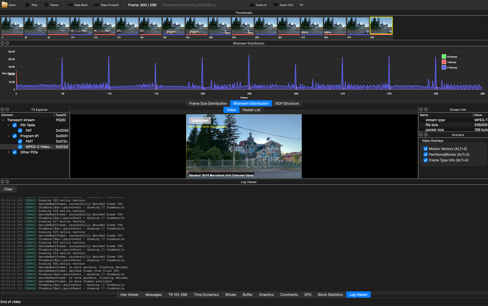
*Complete interface showing all analysis panels simultaneously without tab switching - thumbnails at top, Explorer on left, Stream Info on right, and video display in center*

### Layout 7: YUV Viewer
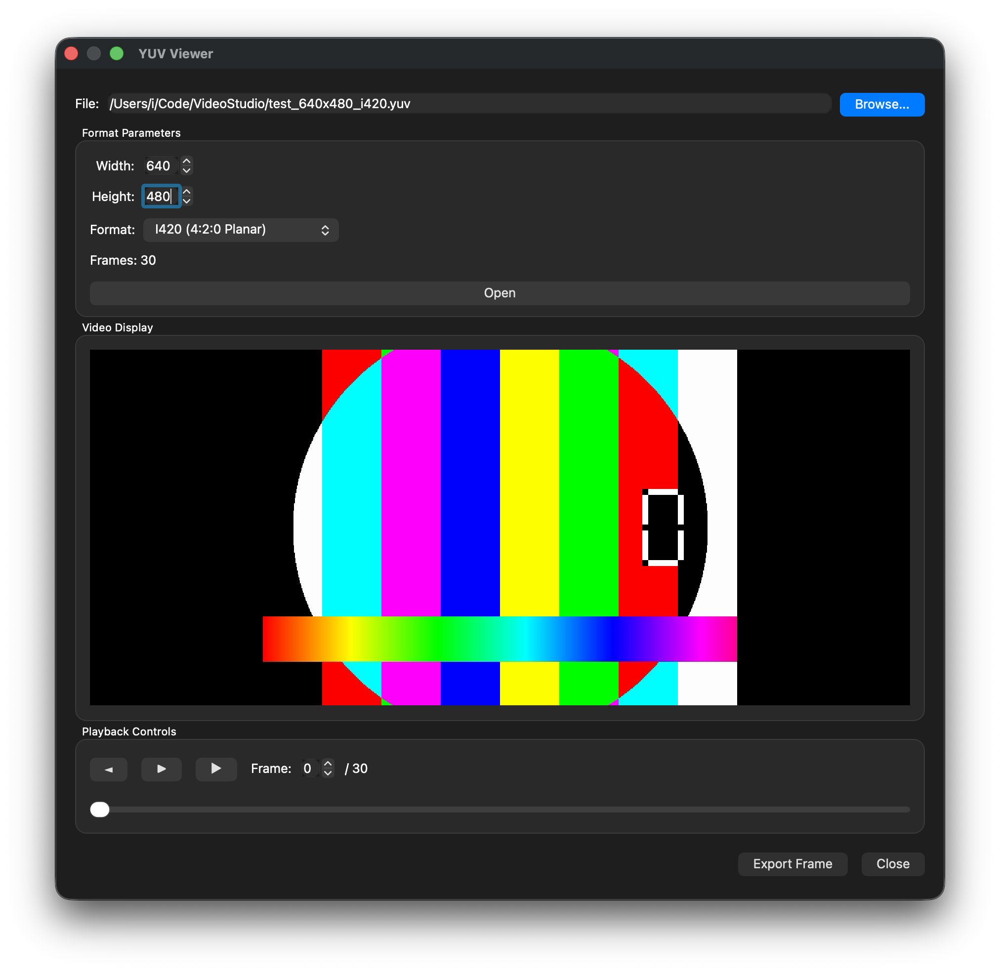
*Raw YUV file viewer with format detection and playback controls*

### Layout 8: Duplicate Frame Detection
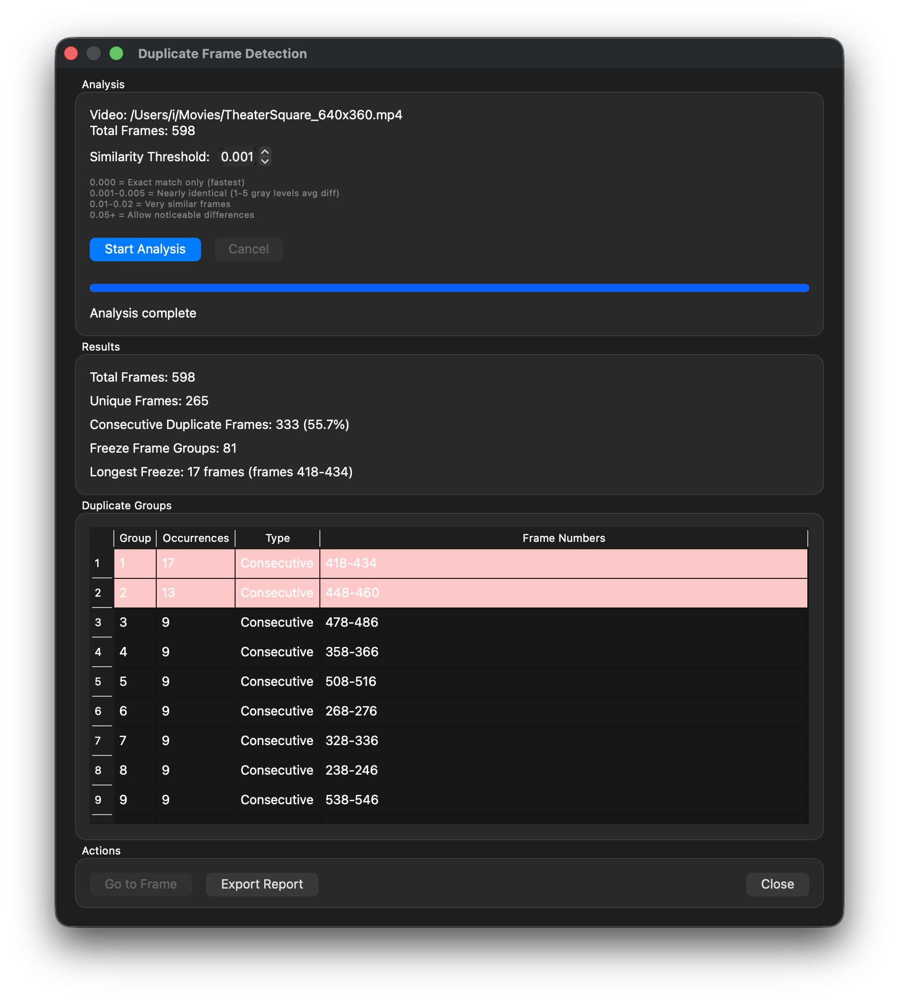
*Duplicate frame detection dialog showing analysis progress and similarity threshold controls*

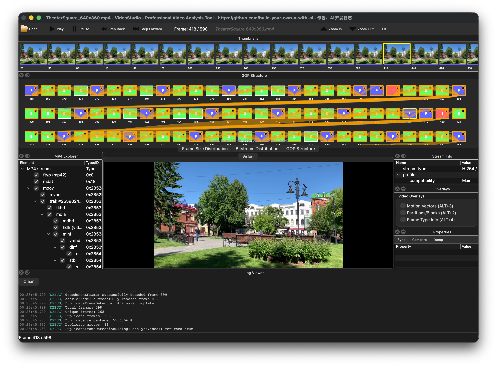
*Analysis results displaying unique frames, duplicate groups, and freeze frame statistics with detailed frame number listings*

### NAL Unit List

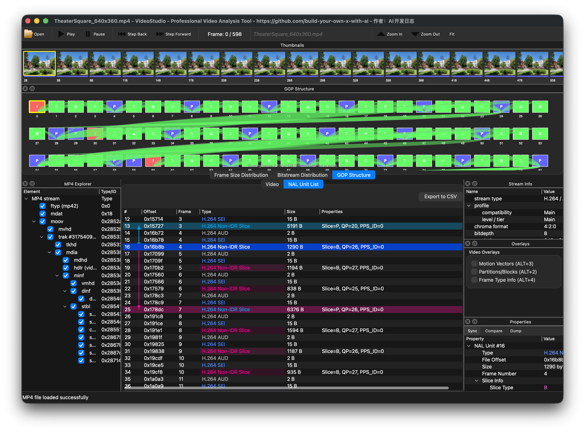

### Theme


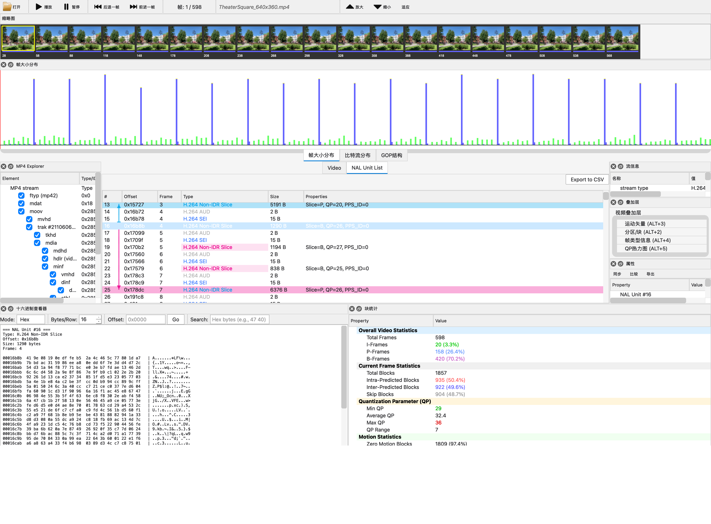

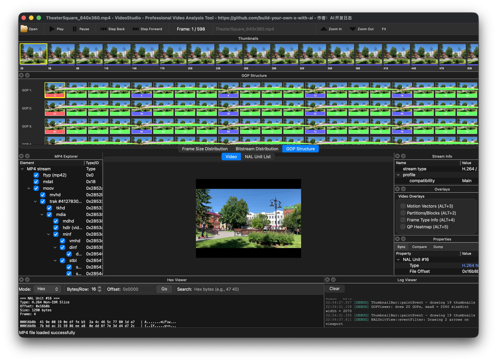


## Requirements

- **macOS**: 10.15 or later
- **Qt**: 6.11.0 or later
- **FFmpeg**: 7.1.1 or later
- **CMake**: 3.16 or later
- **Compiler**: Clang with C++17 support

## Installation

### Install Dependencies

```bash
# Install Homebrew (if not already installed)
/bin/bash -c "$(curl -fsSL https://raw.githubusercontent.com/Homebrew/install/HEAD/install.sh)"

# Install FFmpeg
brew install ffmpeg

# Download and install Qt 6.11.0 from https://www.qt.io/download
```

### Build from Source

```bash
# Clone the repository
git clone https://github.com/build-your-own-x-with-ai/VideoStudio.git
cd VideoStudio

# Create build directory
mkdir build && cd build

# Configure with CMake
cmake .. -DCMAKE_PREFIX_PATH=~/Qt/6.11.0/macos

# Build
cmake --build .

# Run
./VideoStudio.app/Contents/MacOS/VideoStudio
```

## Usage

### Opening Files

#### Video Files
1. Launch VideoStudio
2. Click **File → Open** or press **Cmd+O**
3. Select a video file (MP4, MKV, AVI, MOV, TS, FLV, WebM, H.264, H.265, etc.)
4. Watch the **Log Viewer** showing real-time loading progress
5. Once loaded, the first frame is displayed with analysis panels available

#### Raw YUV Files
1. Click **File → Open YUV File** or press **Cmd+Y**
2. Select a raw YUV file
3. Configure format parameters:
   - **Width** and **Height**: Video resolution
   - **Format**: I420 (4:2:0 Planar), NV12, YV12, I422, I444, etc.
   - **Frames**: Automatically calculated from file size
4. Click **Open** to load the YUV file
5. Use playback controls to navigate through frames
6. Click **Export Frame** to save individual frames as PNG

### Log Viewer

The Log Viewer provides real-time feedback during file operations:
- **Loading Progress**: Shows frame indexing progress (e.g., "Building frame index... 350 / 700 frames (50%)")
- **Container Parsing**: Displays MP4 atom structure, MKV elements, or TS packet analysis
- **Codec Information**: Shows video codec, resolution, frame rate, and stream details
- **Auto-scroll**: Automatically scrolls to show the latest log messages
- **Dockable**: After loading, the Log Viewer moves to the bottom dock area
- **Access**: Click the "Log Viewer" tab at the bottom to view logs anytime

### Navigation

- **Play/Pause**: Click the Play button or press **Space**
- **Step Forward**: Click Step Forward or press **Alt+Right**
- **Step Backward**: Click Step Backward or press **Alt+Left**
- **Seek**: Click on the bar chart or thumbnails to jump to a specific frame

### Quality Metrics Analysis

Compare video quality between reference and distorted versions:

1. Open a reference video file (File → Open)
2. Go to **Tools → Quality Metrics (PSNR/SSIM)** or press **Ctrl+Q**
3. Select the distorted/compressed video to compare
4. Configure frame range and metrics to calculate
5. Configure frame range and metrics to calculate:
   - **PSNR**: Peak Signal-to-Noise Ratio (traditional quality metric)
   - **SSIM**: Structural Similarity Index (perceptual quality)
   - **VMAF**: Video Multimethod Assessment Fusion (Netflix's perceptual quality metric)
6. Click "Start Analysis" to compare frame-by-frame
7. View results:
   - **PSNR**: >40 dB (excellent), 30-40 dB (good), <30 dB (poor)
   - **SSIM**: >0.95 (excellent), 0.85-0.95 (good), <0.85 (poor)
   - **VMAF**: >80 (excellent), 60-80 (good), <60 (poor)

**Note**: Both videos must have the same resolution and should be the same content at different quality levels.

### Export YUV Frames

Export raw YUV frames for external analysis:

1. Open a video file
2. Navigate to the desired frame
3. **File → Export Frame as YUV** (Ctrl+E) - Export current frame
4. **File → Export Frame Range as YUV** (Ctrl+Shift+E) - Export multiple frames
5. Select output location and format

### Export CSV Metrics

Export frame-level metrics and statistics to CSV format:

1. Open a video file
2. **File → Export CSV Metrics** (Ctrl+M)
3. Select output file location
4. Choose data to export:
   - **Frame List**: Frame number, type, size, PTS, DTS, QP, bitrate, timestamp
   - **Statistics**: Total frames, I/P/B frame counts, average bitrate, max/min frame size
   - **GOP Structure**: GOP number, start/end frames, length, frame type distribution
   - **Bitrate Data**: Per-frame instantaneous bitrate
5. Configure frame range (start frame to end frame)
6. Select format options:
   - Delimiter: Comma, Semicolon, or Tab
   - Decimal separator: Dot or Comma
7. Click "Export" to save the CSV file

**Use cases:**
- Import into Excel/Google Sheets for custom analysis
- Generate reports and visualizations
- Compare encoding results across different settings
- Track quality metrics over time

### Bar Chart

The bar chart at the top shows:
- **Bar Height**: Frame size in bytes
- **Bar Color**: Frame type (Red=I-frame, Blue=P-frame, Green=B-frame)
- **Yellow Line**: Key frame indicator
- **Red Vertical Line**: Current frame position

## Architecture

### Core Components

#### Decoders & Readers
- **VideoDecoder** (`src/core/videodecoder.cpp`): FFmpeg integration for decoding with real-time progress signals
- **YUVReader** (`src/core/yuvreader.cpp`): Raw YUV file reader with format detection and frame extraction

#### Parsers
- **TSParser** (`src/core/tsparser.cpp`): MPEG-TS stream analysis with TR 101-290 compliance
- **MP4Parser** (`src/core/mp4parser.cpp`): MP4 container structure analysis
- **MKVParser** (`src/core/mkvparser.cpp`): Matroska container analysis
- **AVIParser** (`src/core/aviparser.cpp`): AVI RIFF chunk analysis
- **FLVParser** (`src/core/flvparser.cpp`): FLV tag structure analysis
- **TimingAnalyzer** (`src/core/timinganalyzer.cpp`): PTS/DTS/PCR timeline analysis

#### Widgets
- **VideoOutput** (`src/widgets/videooutput.cpp`): Video display with YUV to RGB conversion
- **BarChart** (`src/widgets/barchart.cpp`): Bitrate visualization widget
- **AreaChart** (`src/widgets/areachart.cpp`): Time-series data visualization
- **GOPViewer** (`src/widgets/gopviewer.cpp`): GOP structure visualization
- **ThumbnailBar** (`src/widgets/thumbnailbar.cpp`): Frame thumbnail navigation
- **LogViewer** (`src/widgets/logviewer.cpp`): Real-time log display with auto-scroll
- **PacketView** (`src/widgets/packetview.cpp`): TS packet hex viewer

#### Panels
- **BitratePanel** (`src/panels/bitratepanel.cpp`): Frame size and bitrate analysis
- **BufferPanel** (`src/panels/bufferpanel.cpp`): CPB buffer monitoring
- **TR101290Panel** (`src/panels/tr101290panel.cpp`): DVB compliance checking
- **TimeDynamicsPanel** (`src/panels/timedynamicspanel.cpp`): PTS/DTS timeline
- **HexViewerPanel** (`src/panels/hexviewerpanel.cpp`): Raw byte inspection
- **ExplorerPanel** (`src/panels/explorerpanel.cpp`): Container structure tree
- **PropertyPanel** (`src/panels/propertypanel.cpp`): Stream properties
- **MessagesPanel** (`src/panels/messagespanel.cpp`): Warnings and errors
- **EPGPanel** (`src/panels/epgpanel.cpp`): Electronic Program Guide
- **GraphicsPanel** (`src/panels/graphicspanel.cpp`): Visual overlays
- **CommentsPanel** (`src/panels/commentspanel.cpp`): User annotations

#### Dialogs
- **YUVViewerDialog** (`src/dialogs/yuvviewerdialog.cpp`): Raw YUV file viewer
- **QualityMetricsDialog** (`src/dialogs/qualitymetricsdialog.cpp`): PSNR/SSIM comparison
- **ReferenceComparisonDialog** (`src/dialogs/referencecomparisondialog.cpp`): Side-by-side comparison
- **YUVExportDialog** (`src/dialogs/yuvexportdialog.cpp`): YUV frame export
- **CSVExportDialog** (`src/dialogs/csvexportdialog.cpp`): CSV metrics export
- **SaveStreamInfoDialog** (`src/dialogs/savestreaminfodialog.cpp`): Stream info export
- **AboutDialog** (`src/dialogs/aboutdialog.cpp`): About and help

#### Main
- **MainWindow** (`src/mainwindow.cpp`): Main application window and UI coordination

### Technology Stack

- **Qt 6**: Cross-platform GUI framework
- **FFmpeg**: Video decoding and codec support
- **CMake**: Build system
- **C++17**: Modern C++ features

## Development

### Project Structure

```
VideoStudio/
├── CMakeLists.txt              # Build configuration
├── src/
│   ├── main.cpp                # Entry point
│   ├── mainwindow.h/cpp        # Main window
│   ├── core/                   # Core engine
│   │   ├── videodecoder.h/cpp  # FFmpeg wrapper
│   │   └── framedata.h/cpp     # Data structures
│   └── widgets/                # Custom widgets
│       ├── videooutput.h/cpp   # Video display
│       └── barchart.h/cpp      # Bar chart
├── resources/                  # Icons and resources
└── tests/                      # Unit tests
```

### Building in Qt Creator

```bash
# Open project in Qt Creator
~/Qt/Qt\ Creator.app/Contents/MacOS/Qt\ Creator CMakeLists.txt
```

### Code Style

- Follow Qt coding conventions
- Use Qt containers (QVector, QString, etc.)
- Namespace: `VideoStudio`
- Use signals/slots for event handling
- Smart pointers for resource management

## Contributing

Contributions are welcome! Please feel free to submit a Pull Request.

1. Fork the repository
2. Create your feature branch (`git checkout -b feature/AmazingFeature`)
3. Commit your changes (`git commit -m 'Add some AmazingFeature'`)
4. Push to the branch (`git push origin feature/AmazingFeature`)
5. Open a Pull Request

## License

This project is licensed under the MIT License - see the LICENSE file for details.

## Acknowledgments

- Inspired by [Elecard StreamEye](https://www.elecard.com/products/video-analysis/stream-eye)
- Built with [Qt](https://www.qt.io/) and [FFmpeg](https://ffmpeg.org/)
- Thanks to the open-source community

## Roadmap

### Version 1.0 (Current - MVP)
- [x] Basic video decoding with FFmpeg
- [x] Frame-by-frame navigation
- [x] Bitrate visualization (bar chart)
- [x] Video playback controls
- [x] Frame metadata extraction
- [x] Real-time log viewer with auto-scroll
- [x] MP4 container structure analysis
- [x] TS stream packet analysis
- [x] MKV container element analysis
- [x] Multi-threaded file loading with progress feedback

### Version 1.1
- [x] Stream info panel
- [x] Thumbnail navigation bar
- [x] GOP structure viewer
- [x] Quality metrics (PSNR, SSIM)
- [x] Export YUV frames
- [x] Transport stream analysis (TR 101-290 compliance)
- [x] Container parsers (MP4, MKV, AVI, FLV)
- [x] Hex viewer panel
- [x] Time dynamics panel (PTS/DTS/PCR)
- [x] Messages and error reporting

### Version 1.2 (Current)
- [x] Raw YUV file viewer with format detection
- [x] All analysis panels implemented (Bitrate, Buffer, TR 101-290, Time Dynamics, etc.)
- [x] Stream info export functionality
- [x] Reference comparison dialog
- [x] CSV metrics export
- [x] Context menu features for quick access
- [x] Complete UI with dockable panels
- [x] Internationalization support (English, 简体中文)
- [x] Dual theme support (Dark/Light themes)
- [x] GOP dependency arrow visualization
- [x] Duplicate frame detection with similarity threshold
- [x] Motion vector overlay
- [x] Block/partition visualization
- [x] NAL unit list view for MP4/MKV files (H.264/H.265)
- [x] VMAF quality metric (Video Multimethod Assessment Fusion)
- [x] Command-line tool for batch processing and automation

### Version 2.0 (Planned)
- [x] Compliance verification (H.264/H.265 bitstream syntax validation)
- [x] Advanced buffer analysis (HRD/VBV verification)
- [x] Plugin system for custom analyzers

## Support

For questions, issues, or feature requests, please open an issue on GitHub.

## Contact

- **Project**: [VideoStudio](https://github.com/build-your-own-x-with-ai/VideoStudio)
- **Documentation**: See [CLAUDE.md](CLAUDE.md) for development guidelines

---

**Note**: This is an early-stage project under active development. Features and APIs may change.
